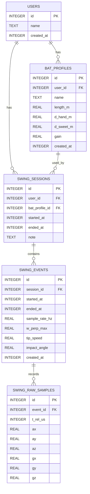

# ER設計（Session/Event/Raw：スイング期間のみ保持）

本ドキュメントは、`docs/architecture.md`（MVVM＋Ports/Adapters）および `docs/requirements_specification.md`（要件）に整合するデータモデルを定義する。スイング期間に限定した Raw センサデータ保存と、計測を束ねるセッション概念を採用する。

---

## 前提と範囲

- Raw センサデータは「スイング期間のみ」保存（イベント開始〜終了内）。常時記録は行わない（将来拡張で検討）
- セッション導入：計測開始/終了で `SwingSession` を作成し、複数 `SwingEvent` を内包
- 複数ユーザー/バット切替に対応（ユーザー別に `BatProfile` を保持）
- 設定値（閾値・フィルタ・補正係数）は DataStore 管理（ER外）。バット幾何は `BatProfile` に保存
- 時刻は epoch millis（INTEGER）。長さ/速度/角速度などは SI 単位（REAL）

---

## エンティティ（最小）

1) users

- 用途: ローカル複数ユーザーの識別（将来クラウド連携の基礎）
- カラム
  - `id` INTEGER PK
  - `name` TEXT NOT NULL
  - `created_at` INTEGER NOT NULL  // epoch millis

2) bat_profiles

- 用途: ユーザー毎のバット幾何/補正設定
- カラム
  - `id` INTEGER PK
  - `user_id` INTEGER NOT NULL FK → users(id)
  - `name` TEXT NOT NULL
  - `length_m` REAL NOT NULL
  - `d_hand_m` REAL NOT NULL
  - `d_sweet_m` REAL NOT NULL
  - `gain` REAL NOT NULL DEFAULT 1.1
  - `created_at` INTEGER NOT NULL

3) swing_sessions

- 用途: 1回の計測操作（開始/終了）を表現
- カラム
  - `id` INTEGER PK
  - `user_id` INTEGER NOT NULL FK → users(id)
  - `bat_profile_id` INTEGER NOT NULL FK → bat_profiles(id)
  - `started_at` INTEGER NOT NULL
  - `ended_at` INTEGER NULL  // 計測中は NULL
  - `note` TEXT NULL

4) swing_events

- 用途: 1スイングの確定イベント（開始/終了、ピーク、速度など）
- カラム
  - `id` INTEGER PK
  - `session_id` INTEGER NOT NULL FK → swing_sessions(id)
  - `started_at` INTEGER NOT NULL
  - `ended_at` INTEGER NOT NULL
  - `w_perp_max` REAL NOT NULL   // rad/s（Z 自転除外の直交成分）
  - `tip_speed` REAL NOT NULL    // m/s（R×w_perp_max×gain）
  - `impact_angle` REAL NULL     // 任意：インパクト近傍の角度
  - `created_at` INTEGER NOT NULL

5) swing_raw_samples

- 用途: イベント区間内の Raw センサー系列（200–1000 Hz 目安）
- カラム
  - `id` INTEGER PK
  - `event_id` INTEGER NOT NULL FK → swing_events(id)
  - `t_rel_us` INTEGER NOT NULL   // イベント先頭からの相対時刻 [μs]
  - `ax` REAL NOT NULL
  - `ay` REAL NOT NULL
  - `az` REAL NOT NULL
  - `gx` REAL NOT NULL  // deg/s → 保持単位は実装方針に依存（推奨: rad/s）
  - `gy` REAL NOT NULL
  - `gz` REAL NOT NULL

---

## リレーション

- users 1 — n bat_profiles
- users 1 — n swing_sessions
- bat_profiles 1 — n swing_sessions
- swing_sessions 1 — n swing_events
- swing_events 1 — n swing_raw_samples

---

## Mermaid ER 図



---

## DDL 概要（SQLite / Room）

```sql
PRAGMA foreign_keys = ON;

CREATE TABLE IF NOT EXISTS users (
  id INTEGER PRIMARY KEY,
  name TEXT NOT NULL,
  created_at INTEGER NOT NULL
);

CREATE TABLE IF NOT EXISTS bat_profiles (
  id INTEGER PRIMARY KEY,
  user_id INTEGER NOT NULL,
  name TEXT NOT NULL,
  length_m REAL NOT NULL,
  d_hand_m REAL NOT NULL,
  d_sweet_m REAL NOT NULL,
  gain REAL NOT NULL DEFAULT 1.1,
  created_at INTEGER NOT NULL,
  FOREIGN KEY (user_id) REFERENCES users(id) ON DELETE CASCADE
);

CREATE INDEX IF NOT EXISTS idx_bat_profiles_user ON bat_profiles(user_id);

CREATE TABLE IF NOT EXISTS swing_sessions (
  id INTEGER PRIMARY KEY,
  user_id INTEGER NOT NULL,
  bat_profile_id INTEGER NOT NULL,
  started_at INTEGER NOT NULL,
  ended_at INTEGER NULL,
  note TEXT NULL,
  CHECK (ended_at IS NULL OR started_at <= ended_at),
  FOREIGN KEY (user_id) REFERENCES users(id) ON DELETE CASCADE,
  FOREIGN KEY (bat_profile_id) REFERENCES bat_profiles(id) ON DELETE RESTRICT
);

CREATE INDEX IF NOT EXISTS idx_sessions_user_started ON swing_sessions(user_id, started_at);

CREATE TABLE IF NOT EXISTS swing_events (
  id INTEGER PRIMARY KEY,
  session_id INTEGER NOT NULL,
  started_at INTEGER NOT NULL,
  ended_at INTEGER NOT NULL,
  sample_rate_hz REAL NULL,
  w_perp_max REAL NOT NULL,
  tip_speed REAL NOT NULL,
  impact_angle REAL NULL,
  created_at INTEGER NOT NULL,
  CHECK (started_at <= ended_at),
  FOREIGN KEY (session_id) REFERENCES swing_sessions(id) ON DELETE CASCADE
);

CREATE INDEX IF NOT EXISTS idx_events_session_started ON swing_events(session_id, started_at);

CREATE TABLE IF NOT EXISTS swing_raw_samples (
  id INTEGER PRIMARY KEY,
  event_id INTEGER NOT NULL,
  t_rel_us INTEGER NOT NULL,
  ax REAL NOT NULL,
  ay REAL NOT NULL,
  az REAL NOT NULL,
  gx REAL NOT NULL,
  gy REAL NOT NULL,
  gz REAL NOT NULL,
  FOREIGN KEY (event_id) REFERENCES swing_events(id) ON DELETE CASCADE
);

CREATE UNIQUE INDEX IF NOT EXISTS idx_raw_event_time ON swing_raw_samples(event_id, t_rel_us);
```

注意:
- SQLite はクロステーブルの CHECK を直接表現できないため、`t_rel_us` ∈ [0, duration*1000] はアプリ側で保証する
- Room 利用時はエンティティ/リレーション注釈で同等の制約を表現する

---

## データ容量と保持

- 200–1000 Hz × 1.0 s × 1イベント ≈ 200–1000 行。1サンプル ~ 56–72B（REAL×6 + INT）→ 1イベント 数十〜数百KB
- イベント削除時は Raw も連鎖削除（ON DELETE CASCADE）
- セッション削除時は配下のイベント→Raw が連鎖削除

---

## 参照と整合

- 設計整合: `docs/architecture.md`（Session/Event/Raw 境界、Repository 実装）
- 要件整合: `docs/requirements_specification.md`（データ管理、スイング検出、WT9011DCL 前提）


