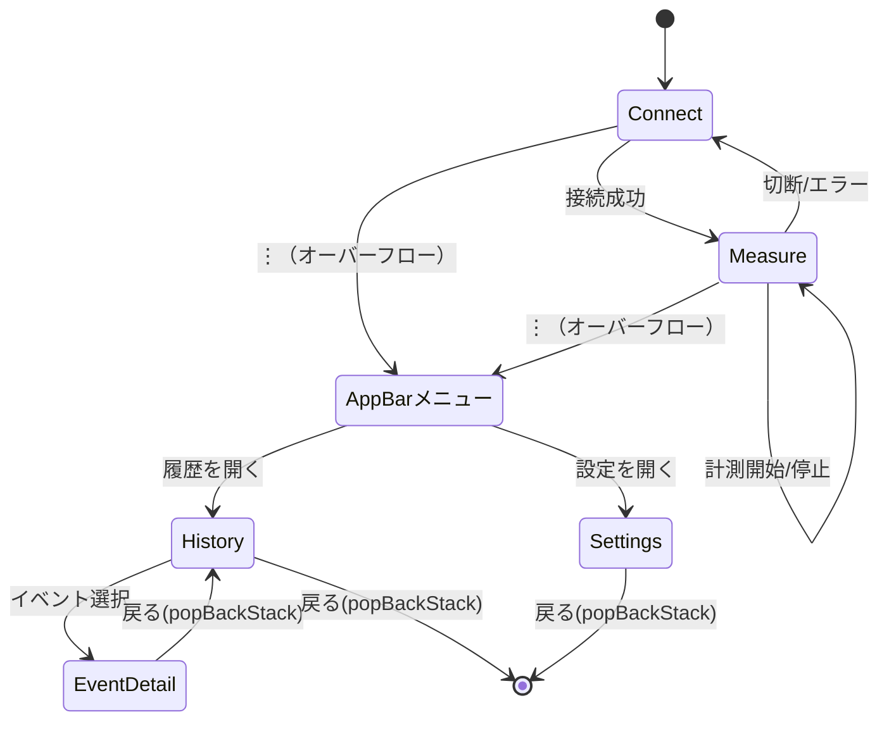

# 画面遷移・機能定義（Compose／スマホ縦向き中心）

本ドキュメントは、`docs/architecture.md` と `docs/requirements_specification.md` に整合し、ナビゲーションと各画面の機能・状態・イベント・ガードを定義する。

---

## ナビゲーション構成

- StartDestination: `Connect`
- Graph: `Connect` → `Measure`
- AppBar メニュー: `History`, `Settings`
- 戻る挙動:
  - `Measure` → `Connect`（切断確認あり）
  - `History`・`Settings` は `popBackStack()`

### 画面遷移（Mermaid）



### NavHost（Compose）概要（抜粋）

```kotlin
NavHost(navController, startDestination = "connect") {
  composable("connect") { ConnectScreen(...) }
  composable("measure") { MeasureScreen(...) }
  composable("history") { HistoryScreen(...) }
  composable("settings") { SettingsScreen(...) }
  composable("event_detail/{eventId}") { backStackEntry ->
    val eventId = backStackEntry.arguments?.getString("eventId")!!.toLong()
    EventDetailScreen(eventId = eventId, ...)
  }
}
```

---

## 画面別の機能・状態・イベント

### ConnectScreen

- 表示
  - ステータス: `isScanning`, `isConnected`, 権限状態（Bluetooth/位置情報）
  - デバイスリスト
    - 各アイテム: `DeviceItem` データ構造
      - `address`: BLE MAC address （例: "AA:BB:CC:DD:EE:FF"）
      - `name`: BLE advertisement name （null の場合は「不明」と表示）
      - `rssi`: 信号強度 [dBm]（UI では 1–5 段階のシグナルバー表示）
      - `isConnectable`: 接続可能フラグ
      - `lastSeenAtMillis`: リスト更新（古いものは薄表示/削除）
    - リスト更新：スキャン中は 1–2 秒毎に更新（新規/消失デバイスを反映）
- 操作（UiEvent）
  - `StartScan`, `StopScan`, `RequestPermission`, `Connect(address: String)`, `Disconnect`
- 状態（UiState 一例）
  - `devices: List<DeviceItem>`、`isScanning: Boolean`、`permissionState: PermissionState`、`error: String?`
- 遷移
  - 接続成功→ `Measure`
- ガード/エラー
  - **権限未許可フロー** (`requirements_specification.md` 参照)
    - 初回起動時: `RequestPermission` イベント発火
    - ダイアログ表示: 「Bluetooth デバイス接続に必要」「位置情報: スキャン補助」
    - ユーザー選択:
      - 「許可」: 各権限 Runtime Permission 要求
      - 「詳細」: 背景説明を表示
      - 「スキップ」: ConnectScreen に留まり、権限表示は常時
    - 権限取得後: 自動でスキャン開始
    - 永続拒否: 「設定アプリを開く」ボタン表示
  - **接続失敗/タイムアウト**: トースト＋「再試行」ボタン表示

### MeasureScreen

- 表示
  - リアルタイム指標: `A(t)`、`W⊥(t)` の要約（数値/ゲージ）
  - 最新スイング: `tip_speed`（km/h表示）、`w_perp_max`
  - セッション情報: 開始時刻・カウント
  - ボタン: 計測開始/停止、セッション終了
- 操作（UiEvent）
  - `StartMeasuring`, `StopMeasuring`, `EndSession`, `AcknowledgeSaved`
- 状態（UiState 一例）
  - `swinging: Boolean`, `wPerpMax: Float`, `tipSpeed: Float`, `sessionInfo: SessionInfo?`, `saving: Boolean`
- ガード/エラー
  - 切断/エラー時: 確認ダイアログ→ `Connect` へ復帰（未保存イベントがあれば保存処理）
  - ドロップ可否: 検出側は `buffer(CONFLATED)` 可、Raw保存側はドロップ禁止

### HistoryScreen

- 表示
  - リスト: 日付、速度、角度、ユーザー、セッション/イベント単位
  - フィルタ/並び替え（最新順/速度順）
- フィルター
  - ユーザー（`user_id`）
  - セッション（`session_id`）
  - 期間（from/to）
  - バットプロファイル（`bat_profile_id`）
  - 速度レンジ（`tip_speed` min/max）
- 操作（UiEvent）
  - `SetUserFilter(id)`, `SetSessionFilter(id)`, `SetDateRange(from,to)`, `SetBatProfile(id)`, `SetSpeedRange(min,max)`, `ChangeSort(order)`, `OpenEvent(eventId)`
- 状態（UiState 一例）
  - `items: List<HistoryItem>`, `filters: HistoryFilter`, `isEmpty: Boolean`, `loading: Boolean`
- DAO検索（参考）
  - `SELECT e.* FROM swing_events e JOIN swing_sessions s ON e.session_id = s.id WHERE s.user_id IN (?) AND s.bat_profile_id IN (?) AND e.started_at BETWEEN ? AND ? AND e.tip_speed BETWEEN ? AND ? ORDER BY e.started_at DESC LIMIT ? OFFSET ?`
- インデックス
  - 既存 `idx_events_session_started` を活用。期間検索が多い場合は `started_at` 単独Indexも検討
  - セッション/ユーザー/プロファイル連動は `JOIN` で対応

### SettingsScreen

- 表示構成
  - **ユーザー選択**: ドロップダウン + 「新規作成」ボタン
  - **バットプロファイルリスト**: 現在のユーザーが所持するプロファイル一覧
  - **編集フォーム**: 選択プロファイル編集時に表示
- バットプロファイル入力フィールド（`requirements_specification.md` 参照）
  - `name`: テキスト入力フィールド
  - `length_m` (L): 数値入力フィールド + ドロップダウン（プリセット）
    - 単位: cm（UI）→ m（DB保存）
    - 範囲: 60–90 cm
  - `d_hand_m` (d_hand): スライダー + リアルタイム数値表示
    - 単位: cm（UI）→ m（DB保存）
    - 範囲: 0–30 cm、スナップ: 5mm単位
  - `d_sweet_m` (d_sweet): スライダー + リアルタイム数値表示
    - 単位: cm（UI）→ m（DB保存）
    - 範囲: 40–80 cm、スナップ: 5mm単位
  - `gain`: スライダー + リアルタイム数値表示
    - 範囲: 0.8–1.3、スナップ: 0.05 単位
    - デフォルト: 1.1
- 操作（UiEvent）
  - `SaveBatProfile(profile)`, `SwitchUser(userId)`, `CreateProfile`, `DeleteProfile(id)`
  - `UpdateFieldValue(fieldName, value)`（リアルタイム入力反映用）
- 状態（UiState 一例）
  - `profiles: List<BatProfile>`, `currentUser: User`, `editing: BatProfile?`, `saving: Boolean`

### EventDetailScreen

- 目的
  - 1スイング内で「バットがどのように加速していったか」を可視化
- 入力
  - `eventId`
- 表示
  - 時系列グラフ: `W⊥(t)`, `A(t)`, `tip_speed(t) = W⊥(t)×R×gain`
  - メタ情報: 最高速度/ピーク時刻/サンプル数/記録時 `sample_rate_hz`
- データ
  - `swing_raw_samples`（`event_id`、`t_rel_us`）を取得
  - `sample_rate_hz` をDBから取得し、デシメート戦略を決定
    - 200 Hz の場合：デシメート不要（そのままプロット）
    - 1000 Hz の場合：5倍デシメート（200 Hz相当に）
  - `W⊥(t) = sqrt(ωx² + ωy²)`（内部は rad/s 推奨。deg/sなら変換）
  - `A(t)` は重力除去・スムージング（初期は軽い移動平均でも可）
- パフォーマンス
  - グラフ描画用にデシメート（例: Raw Hz → 200Hz 目安）
    - `decimationFactor = ceil(sample_rate_hz / 200f)` で動的決定
  - `t_rel_us` を秒へ変換して x 軸に使用
- 操作（UiEvent）
  - `Load(eventId)`, `SetSmoothing(windowMs)`, `ToggleSeries(Wperp|A|TipSpeed)`
- 技術選択
  - MPAndroidChart を採用（ピンチ/パン/ダブルタップズーム対応）
    - 依存関係（例）
      ```kotlin
      dependencies {
        implementation("com.github.PhilJay:MPAndroidChart:3.1.0")
      }
      ```
    - Compose ラップ例（抜粋）
      ```kotlin
      AndroidView(factory = { context ->
        LineChart(context).apply {
          setScaleEnabled(true)
          setPinchZoom(true)
          isDoubleTapToZoomEnabled = true
          description.isEnabled = false
          legend.isEnabled = true
          xAxis.position = XAxis.XAxisPosition.BOTTOM
          axisRight.isEnabled = false
          setTouchEnabled(true)
          isDragEnabled = true
        }
      }, update = { chart ->
        val wEntries = wPerp.map { Entry(it.tSec, it.value) }
        val aEntries = aNorm.map { Entry(it.tSec, it.value) }
        val vEntries = tipSpeed.map { Entry(it.tSec, it.value) }

        val dataSets = listOf(
          LineDataSet(wEntries, "W⊥(rad/s)").apply { color = Color.RED; setDrawCircles(false); lineWidth = 1.5f },
          LineDataSet(aEntries, "A(m/s²)").apply { color = Color.BLUE; setDrawCircles(false); lineWidth = 1.5f },
          LineDataSet(vEntries, "v_tip(m/s)").apply { color = Color.GREEN; setDrawCircles(false); lineWidth = 1.5f }
        )
        chart.data = LineData(dataSets)
        chart.invalidate()
      })
      ```
    - 実装メモ
      - 表示はデシメート（例: 1000Hz → 200Hz）して点数を抑制（系列あたり ≤ 400点目安）
      - x軸は `t_rel_us / 1e6` を秒表示に整形（`ValueFormatter`）
      - ピーク値の `Highlight`、凡例色分け、左右軸の使い分けは必要に応じて設定

---

## 権限/エラー/空状態

- 権限
  - `Connect` で Bluetooth/位置情報の不足を検出し、要求→結果ハンドリング（許可/永久拒否）
- エラー
  - 接続失敗/切断/タイムアウト: トースト＋再試行。計測中切断→確認後セッション終了
- 空状態
  - `History` にプレースホルダ（「まだスイングが記録されていません」）＋計測開始導線
  - `Settings` にプロファイル未作成時のガイダンス

---

## UI方針（縦向き）

- アプリバー＋オーバーフローメニュー（`History`/`Settings`）
- `Measure`: 上＝リアルタイム数値、中＝ゲージ、下＝開始/停止ボタン
- スクロール時も重要指標は常時表示（SmallTopAppBar + pinned）

---

## 受け入れ基準

- 本書に以下を含む
  - ナビグラフ（Mermaid）と Compose `NavHost` 概要
  - 各画面の表示/操作/状態/遷移/ガード
  - 権限/エラー/空状態の扱い
  - 縦向き UI 指針
- `docs/architecture.md` と `docs/requirements_specification.md` に整合


